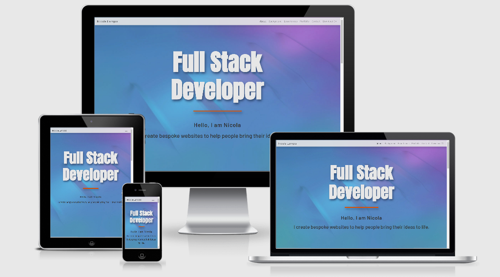
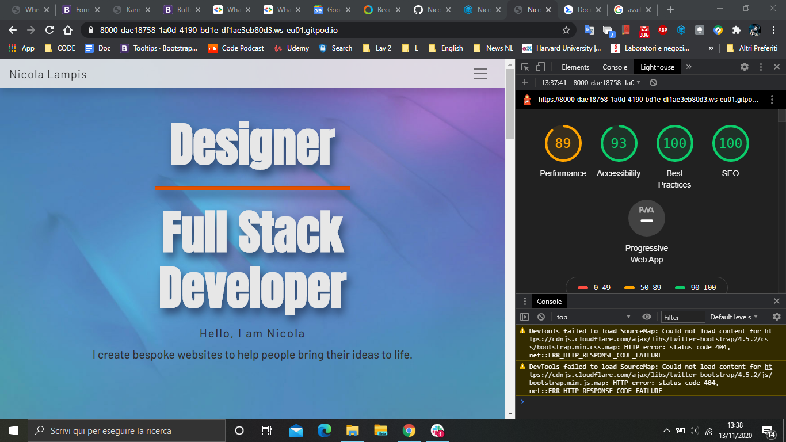

# [Nicola’s online CV](https://nicolalampis.github.io/Nicola_online_CV/)

[Live Demo](http://ami.responsivedesign.is/?url=https://nicolalampis.github.io/Nicola_online_CV/)

> - Overview
> - Description
> - User Stories
> - UX
> - Features
> - Technologies Used
> - References for learning
> - Testing
> - Code validity
> - Version Control
> - Deployment
> - Credits
> - Acknowledgments

## Overview

The client is getting into a career transition in full stack development. He needs an online CV + portfolio that can promote him to employers in the tech field.

## Description

This is an online CV + Portfolio for Nicola, who is a designer and full stack developer. This project showcases his professional and personal information.

## User Stories

The site's users are employers or recruiters.  

An employer expects to see a showcase of Nicola's work. A recruiter I expect to see a showcase of Nicola's resume.

## UX

This website is only about one subject, and it is important to have a first good impression and a pleasing experience, to achieve the final goal.

### STRATEGY PLANE

#### Project goals

> - Make a good impression for potential employers. Get hired. 
> - Get to know Nicola, learn about his skills and his works. Showcase the information needed by an employer.
> - Generating a professional impression and a sense of trust.
> - Showcase both coding skills and design skills.
 
#### Customer goals

> - Design a website with the mobile-first approach
> - Clear info summarised and Easy-to-Read. The content is adequate, understandable and not overwhelming.
> - Imagery used for intuitive explanation of work skills.
> - Icons used to condense extra information and give an appealing look.
> - Fixed navigation bar on top provides users with easy navigation.
> - Fixed footer provide quick and easy-to-find reference to Social Media links.
> - Users can contact the customer in a variety of ways, through contact form, phone, email and Social Media.
> - Simple design and architecture of the website, fast to view.

### SCOPE PLANE

How can employers easily evaluate Nicola’s skills?  

What does the employer need to do it?  

A recruiter wants to:
> - view the skill sets.
> - see work history.
> - discover a portfolio that showcases the actual proficiency of work skills.
> - get personal details.
> - easily contact the candidate.

I've decided on a clean UX for users. It is useful for the scope and it fits my current skill set.
The focus is on keeping things simple and useful.

### STRUCTURE PLANE

> - I have chosen a one page website design. 
> - Responsive design, to be visualized in all screens.
> - The structure is linear and allows users to have a general impression by scrolling through the sections in a fast and simple way without losing anything. 
> - With short and focused paragraphs of content, users can quickly assimilate the information and imagery, so the level of attention remains constant.
> - Informations provided are enough and not overwhelming. Specific extra infos are accessible through selection and direct user interaction.
> - Animations are simple and essential.
> - The user can choose the preferred way of contacting the candidate via email, phone, contact form and links to Social Media at the bottom of the page and in the Footer.
> - The fixed navbar helps to easily jump from one section to another.

 I wanted them to know what I do and who I am, be able to quickly access my resume and work that I've done, providing a short summary of main technologies and tools that I use. 
 A link to my LinkedIn profile, my GitHub, and a downloadable PDF version of my CV were also provided for their ease of access.

### SKELETON PLANE

> - One page website with five sections
> - About, Background, Experiences, Portfolio and Contact sections.
> - In the navbar and footer there is a link that open, in a new tab, the CV.
> - Navbar fixed on top, five heading pointing to the relative section and one pointing to the PDF CV.
> - Contact form with Name, Email and Message imputs.
> - Personal links to Linkedin, GitHub and Instagram are accessible in the footer.
> - In the footer there are phone and email contacts.

[Wireframe - First concept of the site](development/wireframe.jpg)

### SURFACE PLANE

The visual experience is relaxing but not boring. White is the main background. Blue is another style of background with minor violet accents.

Orange is the main accent, eye-catcher, used for titles, contents and divider.

#### Colours

Main color and empty space is white, with black text and accents in orange for titles.  

Background images are mainly blue (#314c74) with violet transitions.  

I designed the two background images using 3D modeling. 

Blue provides a calm mood and a professional impression. Orange is more vibrant and enlightens sections and important content. 

#### Typography

Anton is a free font by GoogleFonts. I used as main title of the landing page and the titles of the sections.  

Is a robust and squared font.  

Barlow is again by GoogleFonts, I chose it because it is slightly stretched in height, just like the Anton font, and is also very formal and minimal.

## Features

The site uses a navbar feature in Bootstrap together with cards. 

The navbar is fixed on top and gives easy access to all the site.  

Cards provide clarity and order through all the contents.  

### Features Left to Implement

In the future, I would like to add further projects that are now shown as in progress.  

Implement the contact section with a real data post when the technology is learnt.

## Technologies Used

> - HTML  
> - CSS  
> - GitPod  
> - Bootstrap (version 4.5.2)  
> - Google Fonts  
> - GitHub

## References for learning

Bootstrap documentation  

https://www.w3schools.com/   

https://stackoverflow.com/ 

https://web.dev/

## Testing

If you try to submit the contact form with an invalid email address, a popup will let you know the error.  

I added a 'required' attribute to the 'name,' 'email,' and 'message' fields, so no fields will be missing, and is possible to submit only in a correct way.  

I used 'target="_blank"' so all the external links and the CV will open in a new tab of the browser.  

In addition to that I used 'rel="noreferrer"' attribute to improve performance and prevent security vulnerabilities.  

All links have been manually tested to ensure that they are pointing to the correct destination.
> - Navbar links tested - logo, about, background, experiences, portfolio, contact, download CV.
> - Portfolio links tested - icon instagram, icon facebook, button Moebius Band.
> - Contact form, input tested - name requested, email requested, email format with @ simbol, message requested.
> - Footer links tested - links icon (CV, linkedin, github, instagram)
> - Footer icons amination tested. 
> - Footer and Navbar - download CV open the PDF in a new tab.

The buttons 'In Progress' are disabled.

The navbar collapse and dropdown works. Mobile tested

Responsive behavior of rows and columns works correctly.

In order to have a pleasing responsive visualization of the landing page I created and styled two media queries for portrait and landscape mode.

I viewed my website on several devices and no problem was found.

Removed dead rules in CSS.

Format and indent CSS and HTML.

Screen reader accessibility has been improved (from 93% to 95%) by creating text descriptions, when it is needed, accessible only by screen readers.

All the images are saved with a web compression in photoshop. JPGs are lighter and the browser runs faster with a great improvement in performance.

A Favicon is added as PNG format.

The site is compatible with Chrome and other browsers, all vendor prefixes added.

Improvement in Chrome-Lighthouse development tests  

## Code validity

[CSS Validation Service](https://jigsaw.w3.org/css-validator/) 
This document validates as CSS level 3 + SVG 

[Markup Validation Service](https://validator.w3.org/)
Document checking completed. No errors or warnings to show.

[Vendor Prefixes](https://autoprefixer.github.io/)
Autoprefixer parses the CSS and adds vendor prefixes

## Version Control

The history of every file in this repository is stored in Git and can be restored.

Logs shows the date, author and messages committed.

The 'Reset' command will restore the version selected. 

## Deployment

This project was developed using the GitPod IDE, committed to git and pushed to GitHub.

> - To deploy this page to GitHub Pages, first I wnet to the GitHub repository.
> - Under the 'Settings section', scrolled down to GitHub 'Pages' section.
> - Under the 'Source' drop-down, the 'Master branch' was selected. The page was automatically refreshed and the website deployed.
> - The code can be run locally through clone or download.
> - Open the repository, click on the green 'Code' button and select either 'clone or download'.
> - The Clone option provides a url, which you can use on your desktop IDE.
> - The Download ZIP option download a ZIP file you can use on your local machine.

[You can run the site here](https://nicolalampis.github.io/Nicola_online_CV/)

## Credits

> - Image from Duetti Pizza is property of Duetti.  
> - Image from Moebius band obtained from the Artist Emanuele "SKAN" Boi. 
> - Image from Sona pickups obtained from Nicola Lampis.
> - All text content is written by Nicola Lampis.
> - Background images (About and Contact section) are modeled and rendered on Rhinoceros by Nicola Lampis.

## Acknowledgments

My mentor Medale Oluwafemi guided me towards the content creation and the responsive design of the site.  

I received inspiration for this project from his experience and from previous projects done by students of Code Institute.

